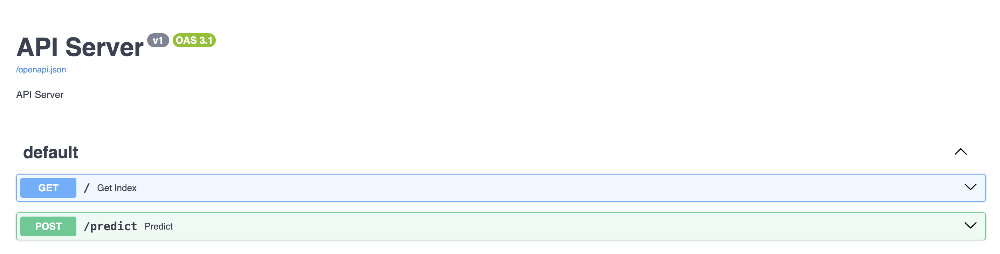
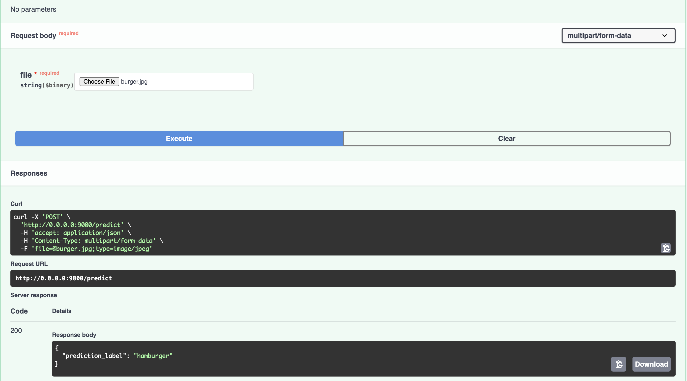
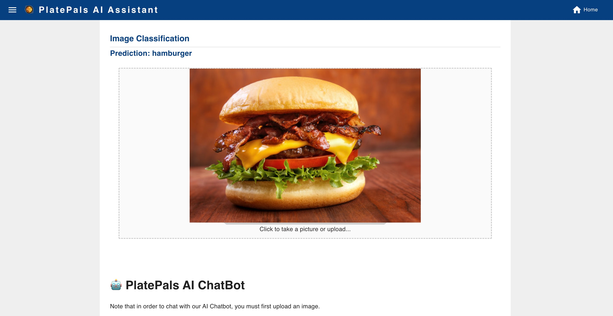
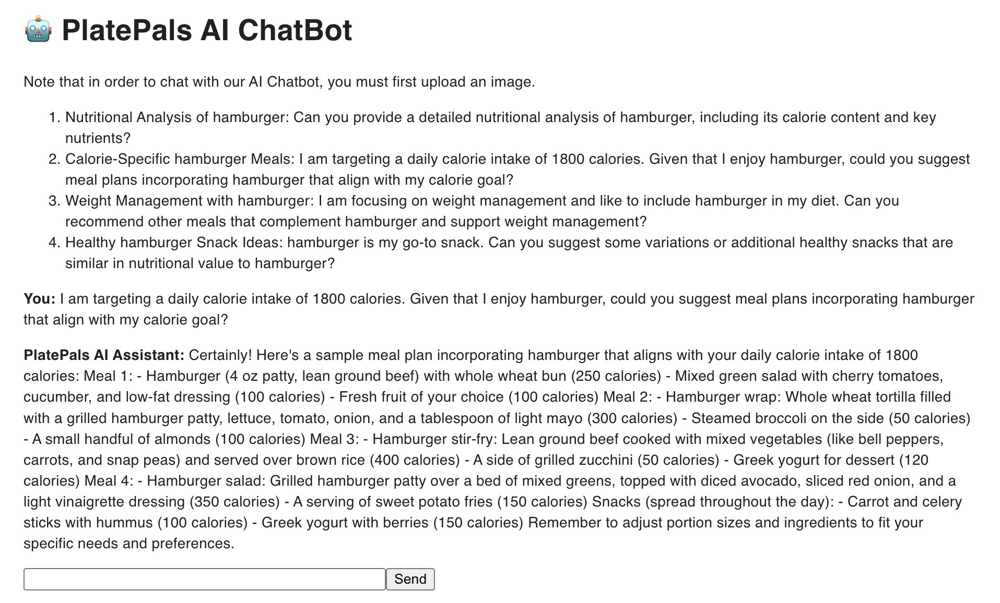
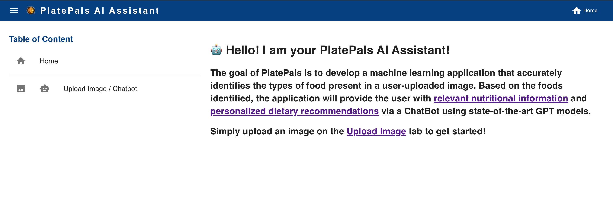
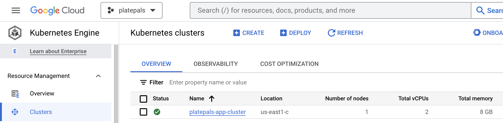
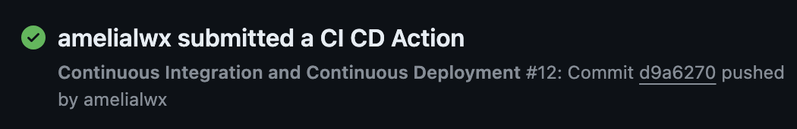
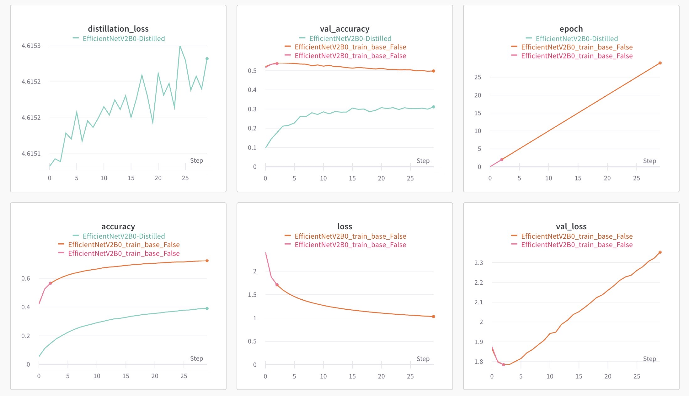

AC215 - PlatePals
==============================

### Presentation Video ###
[Link](https://drive.google.com/file/d/1nzmvpYT076aG2-Ogm73XQBraR0olj4Ex/view?usp=sharing)

### Blog Post Link ###
[Link]()

Project Organization
------------

    .
    ├── .github
    │   └── workflows
    │       └── ci-cd.yml
    ├── LICENSE
    ├── README.md
    ├── assets
    │   ├── ansible_deployment.png
    │   ├── backend_api.png
    │   ├── backend_api2.png
    │   ├── bucket-data.png
    │   ├── bucket-trainer.png
    │   ├── cicd.png
    │   ├── distillation_wandb.png
    │   ├── dvc-tag.png
    │   ├── frontend-chatbot.jpg
    │   ├── frontend-home.jpg
    │   ├── frontend-pred.jpg
    │   ├── kubernetes_cluster.png
    │   ├── platepals_demo.gif
    │   ├── solution_architecture.png
    │   ├── technical_architecture.png
    │   ├── vertex-ai-complete.jpg
    │   ├── vertex-ai-finished-jobs.png
    │   ├── vertex-ai-pipeline.png
    │   ├── wandb-api-key.png
    │   └── wnb.jpg
    ├── data
    │   └── preprocessed_data.dvc
    ├── notebooks                   <- Jupyter notebook for model training
    │   └── model_training.ipynb
    ├── presentations               <- Folder containing midterm and final presentation slides
    │   ├── final.pdf
    │   └── midterm.pdf
    ├── references                  <- Reference material
    │   └── EfficientNetV2.pdf
    ├── reports                     <- Folder containing previous milestone markdown submissions
    │   ├── milestone2.md
    │   ├── milestone3.md
    │   ├── milestone4.md
    │   └── milestone5.md
    ├── requirements.txt
    └── src                         <- Source code and Dockerfiles for data processing and modeling
        ├── api-service             <- Code for App backend APIs
        │   ├── Dockerfile
        │   ├── Pipfile
        │   ├── Pipfile.lock
        │   ├── api
        │   │   ├── model.py
        │   │   └── service.py
        │   ├── docker-entrypoint.sh
        │   └── docker-shell.sh
        ├── deployment              <- Code for App deployment to GCP
        │   ├── Dockerfile
        │   ├── Pipfile
        │   ├── Pipfile.lock
        │   ├── deploy-app.sh
        │   ├── deploy-create-instance.yml
        │   ├── deploy-docker-images.yml
        │   ├── deploy-k8s-cluster.yml
        │   ├── deploy-provision-instance.yml
        │   ├── deploy-setup-containers.yml
        │   ├── deploy-setup-webserver.yml
        │   ├── docker-entrypoint.sh
        │   ├── docker-shell.bat
        │   ├── docker-shell.sh
        │   ├── inventory-prod.yml
        │   ├── inventory.yml
        │   ├── nginx-conf
        │   │   └── nginx
        │   │       └── nginx.conf
        │   ├── run-data-processor.sh
        │   ├── run-ml-pipeline.sh
        │   └── update-k8s-cluster.yml
        ├── frontend-react          <- Code for App frontend
        │   ├── Dockerfile
        │   ├── Dockerfile.dev
        │   ├── conf
        │   │   └── conf.d
        │   │       └── default.conf
        │   ├── docker-shell.sh
        │   ├── package.json
        │   ├── public
        │   │   ├── index.html
        │   │   └── manifest.json
        │   ├── src
        │   │   ├── app
        │   │   │   ├── App.css
        │   │   │   ├── App.js
        │   │   │   ├── AppRoutes.js
        │   │   │   └── Theme.js
        │   │   ├── common
        │   │   │   ├── Content
        │   │   │   │   ├── index.js
        │   │   │   │   └── styles.js
        │   │   │   ├── Footer
        │   │   │   │   ├── index.js
        │   │   │   │   └── styles.js
        │   │   │   └── Header
        │   │   │       ├── index.js
        │   │   │       └── styles.js
        │   │   ├── components
        │   │   │   ├── ChatBot
        │   │   │   │   ├── index.js
        │   │   │   │   └── styles.js
        │   │   │   ├── Error
        │   │   │   │   └── 404.js
        │   │   │   ├── Home
        │   │   │   │   ├── index.js
        │   │   │   │   └── styles.js
        │   │   │   ├── ImageClassification
        │   │   │   │   ├── index.js
        │   │   │   │   └── styles.js
        │   │   │   └── TOC
        │   │   │       ├── index.js
        │   │   │       └── styles.js
        │   │   ├── index.css
        │   │   ├── index.js
        │   │   └── services
        │   │       ├── Common.js
        │   │       └── DataService.js
        │   └── yarn.lock
        ├── model-training              <- Model training, evaluation, and prediction code
        │   ├── Dockerfile
        │   ├── Pipfile
        │   ├── Pipfile.lock
        │   ├── cli.py
        │   ├── docker-entrypoint.sh
        │   ├── docker-shell.sh
        │   ├── package
        │   │   ├── PKG-INFO
        │   │   ├── setup.cfg
        │   │   ├── setup.py
        │   │   └── trainer
        │   │       ├── __init__.py
        │   │       └── task.py
        │   └── package-trainer.sh
        ├── preprocessing               <- Code for data processing
        │   ├── Dockerfile
        │   ├── Pipfile
        │   ├── Pipfile.lock
        │   ├── cli.py
        │   ├── docker-entrypoint.sh
        │   └── docker-shell.sh
        └── workflow                    <- Scripts for automating data collection, preprocessing, modeling
            ├── Dockerfile
            ├── Pipfile
            ├── Pipfile.lock
            ├── cli.py
            ├── data_processor.yaml
            ├── docker-entrypoint.sh
            ├── docker-shell.sh
            ├── model.py
            ├── model_deploy.yaml
            ├── model_training.yaml
            └── pipeline.yaml

------------

# AC215 - Final Project

### Team Members ###

- Amelia Li
- Rebecca Qiu
- Peter Wu

### Group Name ###

PlatePals

### Project Description ###

The goal of this project is to develop a machine learning application that accurately identifies the types of food present in a user-uploaded image. Based on the foods identified, the application will provide the user with relevant nutritional information and personalized dietary recommendations. This project will involve key phases of data preprocessing, model development, and application interface development, leveraging TensorFlow's Food-101 dataset.

## Data Description ##

We'll predominantly employ TensorFlow's [Food-101 dataset](https://www.tensorflow.org/datasets/catalog/food101), featuring 101,000 annotated food images across 101 categories. Additionally, we will correlate the identified food items with nutritional metrics obtained from Kaggle's Nutrition datasets and a database called Nutritional Facts for Most Common Foods, which together offer around 9,000 nutritional records. Our dataset is securely hosted in a private Google Cloud Bucket.

**Recap of Milestone 2**

In milestone 2, we provide a container that pulls data from the TensorFlow [Food-101 dataset](https://www.tensorflow.org/datasets/catalog/food101), performs train-validation-test split of 75%, 10%, and 15% respsectively, and uploads the files onto our remote GCS bucket as zip files. 

**Recap of Milestone 3**

In milestone 3, we provide a container to read our training, validation, and testing dataset from our remote GCS bucket, fit a CNN model to called EfficientNetV2B0 through a custom job sent to [GCP Vertex AI](https://console.cloud.google.com/vertex-ai/training/custom-jobs) and model dashboard set up through [Weights and Biases](https://wandb.ai/).

**Recap of Milestone 4**

In milestone 4, we distilled our CNN model called EfficientNetV2B0 and provided performance benchmarks and analysis. Furthermore, we documented the successful integration of Vertex AI Pipelines (Kubeflow) for machine learning orchestration and cloud functions for process automation. Additionally, we have added docstrings and type hints to all of our Python functions.

**Recap of Milestone 5**

In milestone 5, we focused on advancing and deploying a user-centric application that integrates the elements established in the preceding milestone. The application's front-end is developed using React, and its deployment is managed through Google Cloud Platform (GCP) Virtual Machines and Ansible for streamlined orchestration and automation. Furthermore, we also added a ChatBot into our app allowing users to chat with an AI based on the food image they uploaded.

## Milestone 6 ##

Upon completing the development of a sturdy Machine Learning pipeline in our preceding milestone, we have constructed a backend API service and a frontend application. We built backend API service using Fast API to expose model functionality to the frontend. We also added APIs that will help the frontend display some key information about the model and data. This will serve as our application for end-users, integrating the diverse elements developed in prior milestones.




**PlatePals App**

A user friendly React app was built to identify food images uploaded by the user using CNN models from the backend. Using the app a user can take a photo of their foods and upload it. The app will send the image to the backend api to get prediction results on a classification label of their foods. Furthermore, an AI Chatbot powered by OpenAI will be enabled along with suggestions for prompts to ask the ChatBot based on the food the model predicted their food was (i.e. Can you provide a detailed nutritional analysis of hamburgers, including its calorie content and key nutrients?).

Here are some screenshots of our app (1st image: CNN Model prediction serving results after user uploaded image, 2nd image: AI ChatBot enabled after prediction along with possible prompt suggestions based on user upload, 3rd image: App home page):





Here is a GIF of our app in action:


**Kubernetes Deployment**

Our frontend and backend were launched on a Kubernetes cluster, which handles load balancing and failover. For creating and updating the Kubernetes cluster, we utilized Ansible scripts. Ansible is beneficial for managing our infrastructure as code, allowing us to efficiently maintain records of our application's infrastructure in GitHub. This approach greatly simplifies and automates our deployment processes.

Here is our deployed app on a K8s cluster in GCP:



### Code Structure ###

The following are the folders from the previous milestones:
```
- preprocessing
- model-training
- workflow
- api-service
- frontend
- deployment
```

**API Service Container**

 This container has all the python files to run and expose the backend APIs. The container has the option to run either the model hosted through Vertex AI endpoint, or run the self-hosted model. The container is set to run the self-hosted model by default.

 To run the container locally:
 
 - Open a terminal and move into `src/api-service`
 - Run `sh docker-shell.sh`
 - Once inside the docker container, run `uvicorn_server`
 - To view and test APIs, go to [localhost:9000](http://localhost:9000)

**Frontend Container**

Here we will use the React frontend framework to build a robust food prediction app. The app will have multiple components and navigation. 

To run the container locally:

- Create a .env file inside the `frontend-react` folder with the variable `REACT_APP_OPENAI_API_KEY` defined.
- Open a terminal and move into `src/frontend-react`
- Run `sh docker-shell.sh`
- If running the container for the first time, run `yarn install`
- Once inside the docker container, run `yarn start`
- Go to ['localhost:300'](http://localhost:3000) to access the app locally

**Deployment Container**

The deployment container helps manage building and deploying all our app containers. The deployment is to GCP and all docker images go to GCR.

**Setup GCP Service Account**
1. Create a secrets folder that is on the same level as the project folder.
2. Head to [GCP Console](https://console.cloud.google.com/home/dashboard).
3. Search for "Service Accounts" from the top search box OR go to: "IAM & Admins" > "Service Accounts" and create a new service account called "platepals-workflow".
4. For "Grant this service account access to project", select "Compute Admin", "Compute OS Login", "Container Registry Service Agent", and "Kubernetes Engine Admin", "Service Account User", and "Storage Admin".
5. Click done. This will create a service account.
6. Click on the "..." under the "Actions" column and select "Manage keys".
7. Click on "ADD KEY" > "Create new key" with "Key type" as JSON.
8. Copy this JSON file into the secrets folder created in step 1 and rename it as "deployment.json".
9. Follow steps 1 to 3 to create another new service account called "gcp-service".
10. For "Grant this service account access to project", select "Storage Object Viewer".
11. Follow steps 5 to 8 and rename it as "gcp-service.json".

**Deployment**

- Open a terminal and move into `src/deployment`
- Run `sh docker-shell.sh`

- Configuring OS Login for service account
```
gcloud compute project-info add-metadata --project <YOUR GCP_PROJECT> --metadata enable-oslogin=TRUE
```
- Create SSH key for service account
```
cd /secrets
ssh-keygen -f ssh-key-deployment
cd /app
```
- Providing public SSH keys to instances
```
gcloud compute os-login ssh-keys add --key-file=/secrets/ssh-key-deployment.pub
```
From the output of the above command keep note of the username. Here is a snippet of the output
```
- accountId: ac215-project
    gid: '3906553998'
    homeDirectory: /home/sa_100110341521630214262
    name: users/deployment@ac215-project.iam.gserviceaccount.com/projects/ac215-project
    operatingSystemType: LINUX
    primary: true
    uid: '3906553998'
    username: sa_100110341521630214262
```
The username is `sa_100110341521630214262`. Add this username to the inventory.yml file. Update the GCP project details and the compute instance details in the inventory.yml file as well.
- Build and Push Docker Containers to GCR (Google Container Registry)
```
ansible-playbook deploy-docker-images.yml -i inventory.yml
```
- Create Compute Instance (VM) Server in GCP
```
ansible-playbook deploy-create-instance.yml -i inventory.yml --extra-vars cluster_state=present
```
Once the command runs successfully, get the external IP address of the compute instance from GCP Console and update the appserver > hosts in inventory.yml file
- Provision Compute Instance in GCP Install and setup all the required things for deployment.
```
ansible-playbook deploy-provision-instance.yml -i inventory.yml
```
- Setup Docker Containers in the Compute Instance
```
ansible-playbook deploy-setup-containers.yml -i inventory.yml
```
- Setup Webserver on the Compute Instance
```
ansible-playbook deploy-setup-webserver.yml -i inventory.yml
```
- Once the command runs, go to `http://<External IP>/`
- Delete the Compute Instance
```
ansible-playbook deploy-create-instance.yml -i inventory.yml --extra-vars cluster_state=absent
```

**Deployment with Scaling using Kubernetes**

Make sure that you are able to deploy with ansible before deploying with Kubernetes.
- Open a terminal and move into `src/deployment`
- Run `sh docker-shell.sh`
- Check version of tools with `gcloud --version`, `kubect1 version`, `kubect1 version --client`
- Check to make sure you are authenticated to GCP with `gcloud auth list`

Build and Push Docker Containers to GCR (Google Container Registry) (This step is only required if you have NOT already done this)
```
ansible-playbook deploy-docker-images.yml -i inventory.yml
```
Create and Deploy Cluster
```
ansible-playbook deploy-k8s-cluster.yml -i inventory.yml --extra-vars cluster_state=present
```
View the App
- Copy the `nginx_ingress_ip` from the terminal from the create cluster command
- Go to the `http://<YOUR INGRESS IP>.sslip.io` to view the app

Delete Cluster
```
ansible-playbook deploy-k8s-cluster.yml -i inventory.yml --extra-vars cluster_state=absent
```
Run ML Tasks in Vertex AI
- Run `python cli.py --data_processor` to run just the data collector on Vertex AI
- Run `python cli.py --model_training` to run just model training on Vertex AI
- Run `python cli.py --model_deploy` to run just the model deployment on Vertex AI
- Run `python cli.py --pipeline` to run the entire ML pipeline on Vertex AI

### Deploy using GitHub Actions ###

We integrated Continuous Integration and Continuous Deployment (CI/CD) using GitHub Actions. This enables us to initiate deployment or other pipeline processes through GitHub Events. Our YAML configuration files are located in the `.github/workflows` directory.

`ci-cd.yml` - This file outlines a comprehensive Continuous Integration and Continuous Deployment (CI/CD) workflow using GitHub Actions. This workflow is triggered on pushes to the "main" branch. It includes several jobs that run on an Ubuntu latest server, leveraging Docker for building and deploying components.

We implemented a CI/CD workflow to use the deployment container to 
* Invoke docker image building and pushing to GCR on code changes
* Deploy the changed containers to update the k8s cluster
* Run Vertex AI jobs if needed

Here is a screenshot showcasing the successful execution of our CI/CD pipeline. Details of the run can be viewed under our repository's [GitHub Actions](https://github.com/amelialwx/AC215_PlatePals/actions).



Discussion Regarding Tools Used
------------
1. **Label Studio**: In our project, the image data is already pre-organized and labeled through a folder-based hierarchy, where each folder name serves as the label for the images contained within it. This structure effectively eliminates the need for a separate labeling tool like Label Studio. Therefore, we have opted not to incorporate Label Studio into our existing data pipeline.

2. **Dask**: In our project, the dataset size is well below the 5GB threshold where distributed computing frameworks like Dask would typically be beneficial.  In this context, the overhead of utilizing Dask outweighs the benefits, making it an overkill solution for our particular use case. Therefore, we have chosen not to integrate Dask into our project's data processing workflow

3. **Remote Data and DVC Integration**: In a previous milestone, we encountered difficulties in integrating DVC into our project due to our dataset being stored remotely in a GCS Bucket. Our initial challenges stemmed from the fact that the in-class examples were tailored for locally-stored data, making our remote setup a complicating factor. However, with the guidance and code provided by the course staff, we were able to successfully adapt the DVC workflow to accommodate our remote storage setup. 

4. **TF Data and TF Records**: Our project employs TensorFlow's tf.data and TFRecords as part of our data pipeline, specifically to facilitate efficient and scalable training of our image classification model based on EfficientNetV2B0. TFRecords offer a compact binary storage format, which is optimized for TensorFlow, allowing for rapid data loading. Coupled with the tf.data, it enables us to create highly performant input pipelines, thereby reducing I/O bottlenecks. By leveraging tf.data and TFRecords, we are able to ensure that the data feeding process doesn't become a bottleneck.

5. **EfficientNetV2B0**: EfficientNetV2B0 is an evolution of the original EfficientNet architecture, designed for both improved accuracy and computational efficiency in the context of image classification tasks. According to [this study](https://arxiv.org/abs/2104.00298), the EfficientNetV2 models train faster while being up to 6.8x smaller. These enhancements make EfficientNetV2B0 an attractive choice for our project, as it allows us to achieve state-of-the-art accuracy while also maintaining computational efficiency, a key factor given the resource constraints that are often present in real-world machine learning projects.

6. **EfficientNetV2B0 Distilled**: 

In our project, we opted for model distillation over other techniques like quantization and compression to optimize our EfficientV2B0 model. The primary reason for this choice is that distillation allows for the preservation of model accuracy while reducing computational overhead. Distillation operates by transferring knowledge from a larger, more complex model (the "teacher") to a smaller, more efficient one (the "student"). This not only enables the student model to learn generalized features effectively but also to mimic the performance of the teacher model closely. Quantization, although effective in reducing model size, can introduce non-trivial quantization errors that compromise the model's accuracy. Compression techniques like pruning might reduce the network's size but can also result in a loss of important features and make the model architecture more complex to handle. Therefore, given that our primary objective was to balance both model size and accuracy efficiently, distillation emerged as the most fitting choice. 

Here are the results that we obtained from our original EfficientNetV2B0 model vs. the distilled model.

From the metrics, it's evident that the distilled version of the EfficientNetV2B0 model underperformed compared to its non-distilled counterpart, even after training for 30 epochs. Distillation, while an effective approach in theory, relies heavily on the quality of knowledge transfer between the teacher and student models. We believe that for case, the student model failed to capture the intricacies and essential features from the teacher model, resulting in suboptimal performance. Additionally, our teacher model might have noisy or redundant features, in which case distillation would propagate those, degrading the student model's performance. Given the significant drop in accuracy, it makes sense to prioritize the metric that is most critical to the project's goals. Therefore, in light of the results and our commitment to achieving the best possible accuracy, we've decided to proceed with the original non-distilled EfficientNetV2B0 model.
